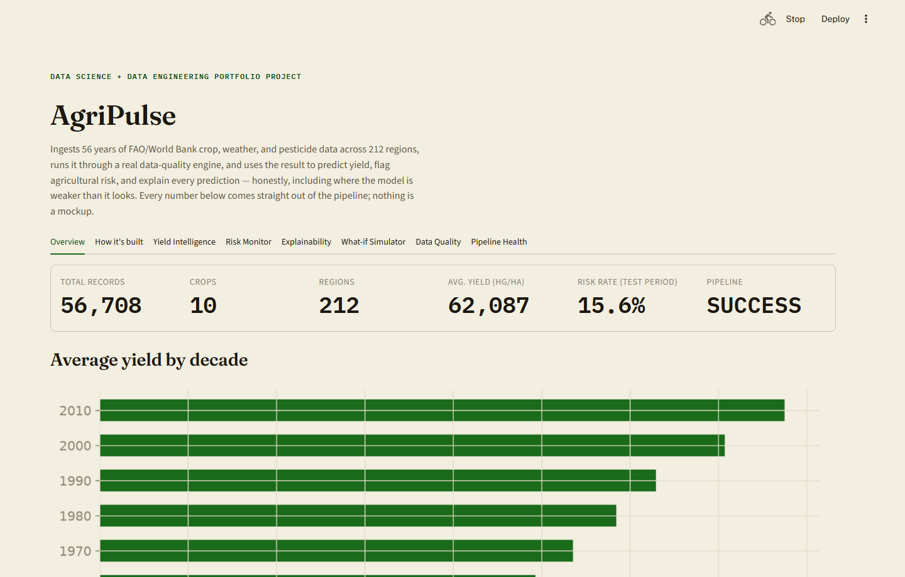

# AgriPulse

**An agricultural intelligence platform, built to be interview-defensible, not just to run.**

AgriPulse ingests 56 years of FAO/World Bank crop, weather, and pesticide data across 212 regions and 10 crops, runs it through a real data-quality engine, and uses the result to predict yield, flag agricultural risk, explain every prediction, and simulate what-if scenarios — all through a decision-support dashboard. It's a 23-phase learning project covering the full data science + data engineering lifecycle: ingestion, quality, SQL, statistics, ML, explainability, Spark, monitoring, and an Azure-ready architecture.

Every number in this README, and every chart in the dashboard, comes straight out of the pipeline. Nothing is a mockup, and nothing is deployed to Azure — see [Limitations](#limitations).



## What it answers

1. What yield should we expect for a crop/region?
2. Which regions have elevated agricultural risk?
3. Which environmental/agricultural variables are associated with expected yield?
4. Can we identify groups of regions with similar growing conditions?
5. What happens to predicted yield when conditions change?
6. How reliable is the underlying data?
7. Is the data pipeline healthy?
8. Is the ML model continuing to perform reliably after "deployment"?

## Key results

| Question | Result |
|---|---|
| Does the yield model beat a real baseline? | **Yes** — Random Forest R²=0.954 vs. a (region, crop) historical-average baseline's R²=0.721, on a temporal holdout (train <2005, test 2005–2016) |
| What does the model actually rely on? | **`lag1_yield` (last year's yield) accounts for 98.5%** of feature importance — an honest finding, not oversold. See [Notable engineering decisions](#notable-engineering-decisions) |
| Is "94% accurate" risk classification good? | A dummy classifier hits **84.4% accuracy with 0% recall** on real high-risk cases — accuracy alone is the wrong metric here. The chosen model: 93.6% accuracy, **ROC-AUC 0.976**, 91.9% recall / 73.5% precision on the risk class |
| How clean is the ingested data? | **94.99% overall quality score** — 132,137 of 139,104 records accepted, every rejection reason-coded and quarantined, nothing silently dropped |
| Does the what-if simulator respond to weather changes? | Barely — a full 0.5×–1.5× rainfall swing moves a prediction by **well under 1%**, directly confirming the persistence-model finding above from an independent angle |
| Is Spark worth using here? | **No, measured, not assumed** — pandas: 0.78s, Spark: 34.0s for the identical transform, almost all of it JVM/query-planning overhead. Spark stays in the repo to demonstrate it, not to replace the real pipeline |

Full methodology, caveats, and the reasoning behind every number: [`docs/decisions.md`](docs/decisions.md) (54 entries) and [`docs/data_dictionary.md`](docs/data_dictionary.md).

## Try it

```bash
streamlit run dashboard/app.py
```

Seven live sections — Overview, Yield Intelligence, Risk Monitor, Explainability, What-if Simulator, Data Quality, Pipeline Health — plus a "How it's built" tab walking through the architecture and the most interesting bugs caught along the way.

## Architecture

```
DATA SOURCES → INGESTION → RAW DATA LAKE → DATA QUALITY → (QUARANTINE | ACCEPTED)
    → TRANSFORMATION/ETL → CURATED DATA → FEATURE ENGINEERING
    → { YIELD MODEL, RISK MODEL, CLUSTERING MODEL } → EXPLAINABILITY
    → DECISION ENGINE (what-if simulator) → DASHBOARD
```

Bad records are quarantined with a machine-readable reason — never silently dropped — and the transform stage only runs on data the quality gate has actually cleared (`pipeline/pipeline.py` orchestrates all four stages in this order; see D15.1 for the real bug this fixed).

Full diagram and design rationale: [`docs/architecture.md`](docs/architecture.md). Azure-ready target architecture (nothing here is deployed): [`docs/azure_architecture.md`](docs/azure_architecture.md).

## Dataset

Multi-source FAO/World Bank agricultural data (yield, pesticide use, rainfall, temperature — four independent raw files, not a pre-merged convenience dataset), mirrored at [StonageBanana/Crop-Yield-Prediction](https://github.com/StonageBanana/Crop-Yield-Prediction). 1961–2016, 212 regions, 10 crops.

Raw files land in `data/external/` (untouched vendor copies, gitignored — re-fetch via `python -m ingestion.csv_ingestion`). Full schema, units, and every data-quality caveat found: [`docs/data_dictionary.md`](docs/data_dictionary.md).

## Repository structure

```
agri-pulse/
├── data/            raw sources -> ingested -> processed -> quarantine (gitignored, reproducible)
├── ingestion/       reads external sources, copies to the raw data lake
├── quality/         schema/business-rule validation, quarantine logic
├── pipeline/        ETL transformations (pandas + a measured PySpark port), orchestration
├── analytics/       EDA, statistics, NumPy fundamentals
├── features/        the shared feature-engineering pipeline + leakage check
├── models/          baseline, yield regression, risk classification, clustering
├── explainability/  feature importance + SHAP per-prediction explanations
├── scenarios/       the what-if simulation engine
├── database/        SQL schema + analytical queries (SQLite)
├── monitoring/      pipeline run tracking + model drift monitoring
├── dashboard/       the Streamlit app
├── tests/           28 pytest tests (transformations, quality rules, features, model schema)
├── notebooks/       EDA report + generated figures
└── docs/            architecture, data dictionary, Azure mapping, the full decision log
```

## Setup

```bash
python -m venv venv
# Windows
venv\Scripts\activate
# macOS/Linux
source venv/bin/activate

pip install -r requirements.txt
```

## Running the full pipeline

```bash
# Ingest -> validate -> transform -> load into SQLite, in the correct order
python -m pipeline.pipeline

# Train and evaluate the models (each also persists a reusable artifact)
python -m models.yield_model
python -m models.risk_model
python -m models.clustering

# Explainability, what-if, monitoring
python -m explainability.feature_importance
python -m scenarios.what_if
python -m monitoring.pipeline_monitor
python -m monitoring.model_monitor

# Tests
pytest tests/ -v

# Dashboard
streamlit run dashboard/app.py
```

Each stage's individual module (`python -m pipeline.transform`, `python -m quality.quality_report`, etc.) can also be run standalone for debugging — see the module docstrings.

## Notable engineering decisions

A sample of real mistakes, found and fixed during development — not a hypothetical "lessons learned" write-up. Full log: [`docs/decisions.md`](docs/decisions.md).

- **A join that looked fine, wasn't (D3.3).** The curated dataset came out at 121,936 rows — more than double the 56,717-row source table. Cause: `temp.csv` is sub-annual, not one row per country-year, so the merge fanned out. Caught by a row-count sanity check, not an error message.
- **The model is a persistence model (D13.1).** SHAP and permutation importance agree: last year's yield explains ~98% of the model's predictions. Reported honestly rather than oversold as "weather-driven" — and the what-if simulator (D14.1) independently confirms it: changing rainfall barely moves the prediction.
- **Measured, not assumed: pandas beat Spark here (D16.1).** Same transform, both engines — pandas ran in 0.78s, Spark took 34.0s, almost all fixed JVM/query-planning overhead. Getting Spark running on Windows also surfaced three genuine, documented environment issues (D16.2), none of which apply on the Linux clusters this would actually run on in production.
- **"HTTP 200" isn't proof a Streamlit app runs (D20.1, D22.1).** `curl` returned 200 while the dashboard was silently crashing on every real session — Streamlit defers script execution until a browser opens a WebSocket, and separately, `streamlit run` doesn't put the project root on `sys.path` the way `python -m` does elsewhere in this project. Caught with a real headless-browser session, not `curl` and not Streamlit's own AppTest framework (which, run in-process, papered over the exact gap the real CLI hit).
- **A test that blamed the wrong function (D21.1).** A test asserted duplicate-row protection was `merge_sources()`'s job. It failed — because that protection actually lives in `clean_temp()`. The fix was rewriting the test's contract, not the code.
- **"Old" isn't the same as "invalid" (D5.1).** An early data-quality rule rejected 31,981 genuine pre-1900 temperature readings as out-of-range. They were real historical records, just older than the yield data's own window — a scoping question, not a validity one.

## Tech stack

Python · pandas · NumPy · scikit-learn · SciPy · SHAP · PySpark · SQLite · Streamlit · pytest · Matplotlib

## Limitations

- Static files, not a live weather/market API — a real deployment would need scheduled ingestion (see [`docs/azure_architecture.md`](docs/azure_architecture.md) for the conceptual Azure Data Factory mapping).
- Country/year-level data (FAO), not farm-level — regional granularity is coarser than an ideal production system, and yield is a national average.
- The yield model is overwhelmingly a persistence model (D13.1) — genuinely useful for smoothed extrapolation, but not a rich simulator of *why* yield changes; the what-if simulator says this explicitly rather than implying otherwise.
- No soil, disease, or drought data exists in this dataset — the risk model's target is deliberately a data-grounded "crop-relative yield underperformance," never labeled as drought or disease risk (D10.1).
- Historical country-name mismatches across sources (e.g. "Sudan (former)", "USSR") are left unmatched rather than guessed at (D3.2) — a documented, quantified gap, not a silent one.
- Nothing described here is deployed to Azure. `docs/azure_architecture.md` describes a conceptual mapping only, per spec's Azure-integrity rule.

## Interview defense

For every major design decision in this project, `docs/decisions.md` answers: what problem it solves, why this approach over the alternatives, what its limitations are, and how it would fail. That standard — not "does the demo run" — is what "complete" means here.

## License / Data attribution

Dataset originally sourced from FAO (yield, pesticide use) and World Bank/derived climate sources; mirrored via the GitHub repository linked above. See [`docs/data_dictionary.md`](docs/data_dictionary.md) for full attribution.
