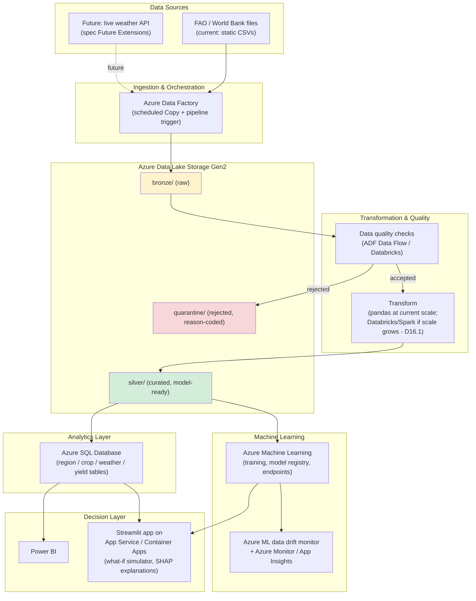

# AgriPulse — Azure-Ready Architecture (Phase 19)

> **Nothing described in this document is deployed.** This is a conceptual mapping from the local implementation (Phases 0-18) to Azure services, written to satisfy spec's explicit rule: *"Do not claim that a component is deployed to Azure unless it actually is."* Every sentence below uses "would map to," "the equivalent would be," or "conceptually" — never "is deployed" or "runs on."

## 1. Cloud basics primer (why any of this, briefly)

- **IaaS vs. PaaS vs. SaaS**: this architecture leans PaaS throughout (Data Factory, Databricks, Azure SQL, ML) — managed services where Microsoft operates the underlying VMs/patching/scaling, and AgriPulse only manages configuration and code. IaaS (raw VMs) would mean managing OS patching for a job this size — no reason to.
- **Region**: a single Azure region (e.g. `East US` or a region close to end users) would host everything for this scale — no cross-region replication need for an MVP with no real-time global user base.
- **Why cloud at all, for a project this small**: honestly, for AgriPulse's actual current data volumes (tens of thousands of rows, low hundreds of MB), a cloud deployment is not *required* by scale (same conclusion as D16.1's Spark finding). The reason to map to Azure regardless is what a production agricultural intelligence platform would need: multiple ingestion sources arriving on a schedule, a team collaborating on the pipeline, access control over who can see/change what, uptime for a dashboard business users depend on, and room to grow — none of which "run a Python script on my laptop" provides.

## 2. Full component mapping

| Local component | Azure equivalent | Why this service |
|---|---|---|
| `ingestion/csv_ingestion.py`, manual dataset download | **Azure Data Factory** (Copy Activity + scheduled trigger) | Managed, schedulable, retriable ingestion with built-in monitoring — replaces a cron job calling a Python script with something a data engineering team can observe and alert on without SSHing into a box. |
| `data/external/`, `data/raw/`, `data/processed/`, `data/quarantine/` | **Azure Data Lake Storage Gen2** (hierarchical namespace), organized as bronze (`raw/`) / silver (`processed/`, quarantine as a sibling `quarantine/` container) / gold (curated, model-ready) zones | ADLS Gen2 is the standard Azure data lake — hierarchical namespace gives POSIX-like directory semantics (matters for partition-style folder layouts) at blob storage cost/scale. The bronze/silver/gold naming is the same raw→validated→curated distinction `docs/architecture.md` already documents locally, just Azure's conventional names for it. |
| `quality/quality_report.py` | Data Factory **Data Flow** validation step, or a Databricks notebook task in the same pipeline | Same logic (schema/rule checks, quarantine routing), running as a pipeline stage instead of a standalone script — output (accepted/quarantine partitions, quality score) still lands in ADLS. |
| `pipeline/transform.py` (pandas) | Small-scale: an Azure Function or a Databricks job on a small cluster running the same pandas code. Large-scale: rewritten as the Spark job it already has a working port of. | D16.1 already measured that pandas beats Spark at THIS data volume (0.78s vs 34.0s) — that conclusion carries over to Azure. The migration trigger isn't "we're in the cloud now," it's "the data no longer fits comfortably in one node's memory," exactly as documented locally. |
| `pipeline/spark_pipeline.py` | **Azure Databricks** (or Azure Synapse Spark pools) | Once the data volume trigger above is hit, Databricks is Azure's managed Spark — autoscaling clusters, notebook/job orchestration, and (unlike this project's local Windows environment) a Linux runtime where the winutils.exe/Hadoop quirks documented in D16.2 simply don't exist. |
| `database/schema.sql`, `agri_pulse.db` (SQLite) | **Azure SQL Database** for this data volume; Synapse/Fabric only if analytical query volume or data size grew by orders of magnitude | SQLite was chosen locally because there's no concurrent-write requirement (D4.1) — that constraint changes the moment multiple pipeline runs or multiple dashboard users need concurrent access, which Azure SQL (a real client-server RDBMS) handles and SQLite doesn't. Synapse/Fabric would be over-provisioned for tens of thousands of rows — named as the eventual option, not the default, to avoid the same "add a technology because it sounds impressive" mistake spec section 1 warns against. |
| `models/*.py`, `data/processed/yield_model.joblib`, `yield_model_card.json` | **Azure Machine Learning** workspace — experiment tracking, model registry (versioning the model card's `model_version` field becomes a registry entry), and a managed online/batch endpoint for serving | Gives the Phase 18 model card concept (version, training metrics, hyperparameters) a real registry instead of a JSON file, plus a deployment target the what-if simulator or dashboard could call instead of loading a local joblib file. |
| `explainability/feature_importance.py` (SHAP) | Same SHAP code, run as an Azure ML training/scoring step; results logged to the ML workspace's run history | No service substitution needed — SHAP runs anywhere Python does; Azure ML just gives the outputs (importance charts, waterfall plots) a persistent, queryable home instead of local PNGs. |
| `monitoring/pipeline_monitor.py`, `monitoring/model_monitor.py` | **Azure Monitor** + **Application Insights** for pipeline run telemetry; Azure ML's built-in **data drift monitor** for the PSI/KS-test logic | Azure Monitor is where Data Factory pipeline runs and their success/failure/duration already land natively; Application Insights would capture custom events (the same `PipelineRunRecord` fields) if more detail than ADF's own logs is needed. Azure ML's model monitoring feature is the managed equivalent of the hand-rolled PSI/KS-test/performance-by-period logic in `model_monitor.py` — same concepts (D18.1-D18.4 apply unchanged), managed scheduling and alerting instead of a script that has to be run manually. |
| `dashboard/app.py` (Phase 20, Streamlit) | **Power BI** (if the audience is primarily analysts who want to explore/filter) or the Streamlit app deployed behind **Azure App Service** (if the interactive what-if simulator's custom logic matters more than native BI exploration) | Named as a real tradeoff, not a foregone conclusion: Power BI is the standard "give business users a dashboard" answer in the Azure ecosystem and integrates natively with Azure SQL/Synapse, but the what-if simulator (Phase 14) and SHAP explanations (Phase 13) are custom Python logic that Power BI doesn't run — those specifically favor keeping the Streamlit app (containerized, deployed to App Service or Azure Container Apps) as the dashboard, with Power BI as a secondary option for pure BI/reporting users. |

## 3. Security / identity (not implemented locally — nothing here currently needs a secret)

The local project has no secrets to protect (public dataset, local SQLite file, no API keys) — but a real deployment introduces several, so the pattern is documented even though nothing here exercises it yet:

- **Azure Key Vault**: would hold the Azure SQL connection string, any external weather-API key (spec's Future Extensions section 20 mentions a real weather API), and the Azure ML workspace's service credentials — never in code or a config file committed to the repo.
- **Managed Identity**: Data Factory, Databricks, and Azure ML would authenticate to ADLS Gen2 and Azure SQL via system-assigned managed identities rather than stored credentials — removes an entire class of "leaked connection string" risk.
- **RBAC**: role-based access control on the ADLS Gen2 containers (e.g., a data engineer role with write access to `raw/`/`processed/`, a read-only analyst role for `processed/`/the warehouse, no direct write access to `raw/` for anyone but the ingestion pipeline's identity) — enforces the same "raw is immutable, don't hand-edit it" principle `docs/architecture.md` already states as a local convention, but as an actual enforced permission instead of a documented norm.
- **Private endpoints / VNet integration**: would keep ADLS Gen2 and Azure SQL off the public internet, reachable only from the VNet Data Factory/Databricks/App Service run in — not needed for a public open dataset today, but the standard pattern the moment any real farm/business data enters the system.

## 4. Target architecture diagram (conceptual)

## 5. What would actually be built first, if this became a real deployment

Not everything in section 2 at once — spec section 1's "no technology without a purpose" rule applies to a real migration too:

1. **ADLS Gen2 + Data Factory** first — replaces the manual download step with a scheduled, monitored ingestion, the highest-value, lowest-risk change.
2. **Azure SQL** next, once more than one person or process needs concurrent read/write access — SQLite's single-writer limitation (D4.1) becomes the actual forcing function, not "because cloud."
3. **Azure ML** once the model needs to serve predictions to something other than a local script — e.g. the dashboard calling a live endpoint instead of loading a joblib file.
4. **Databricks/Spark** only if and when the real data volume grows enough that D16.1's pandas-wins-locally conclusion actually flips — not before, and the switch should be triggered by a measurement (like D16.1's), not a assumption.
5. **Power BI / App Service dashboard** last, once there's a stable data + model layer worth putting a face on.

This ordering itself is worth stating explicitly for the Phase 19 exit criteria ("explain an Azure version of AgriPulse") — the answer isn't just a diagram, it's knowing which piece to build first and why.
