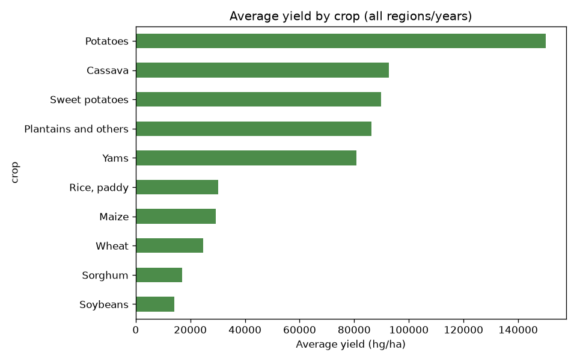
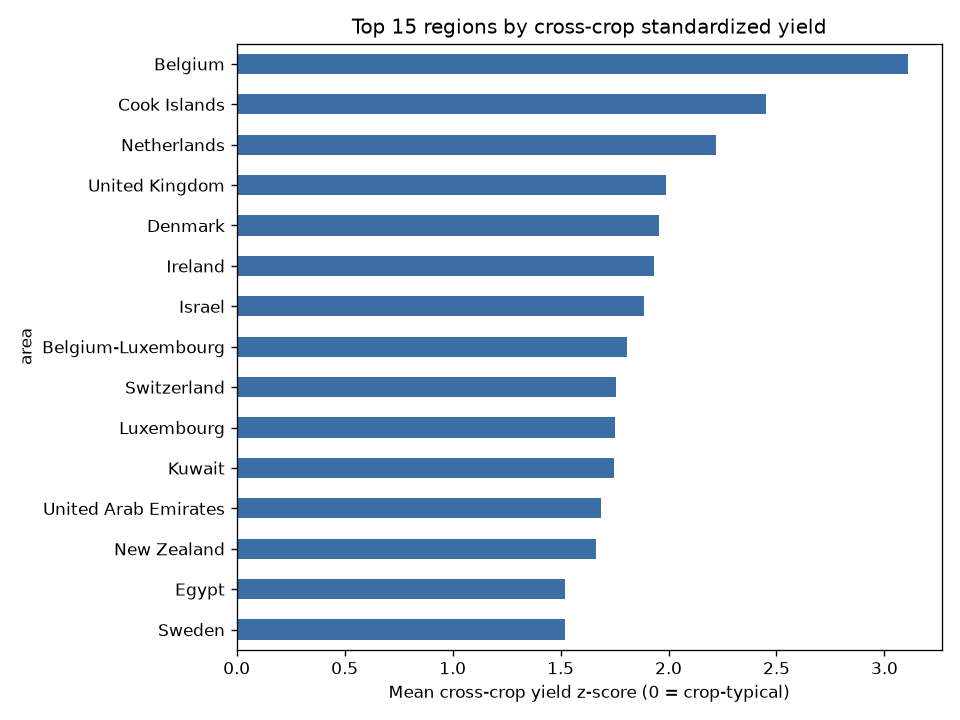
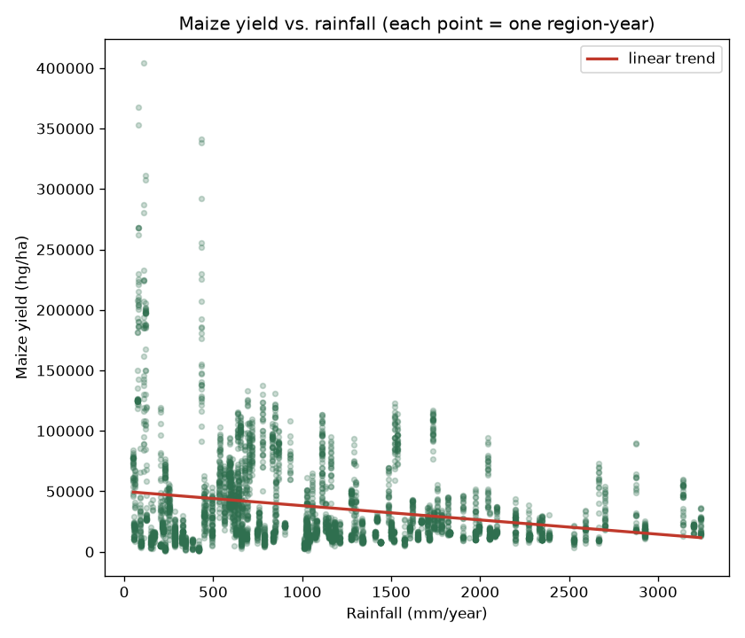
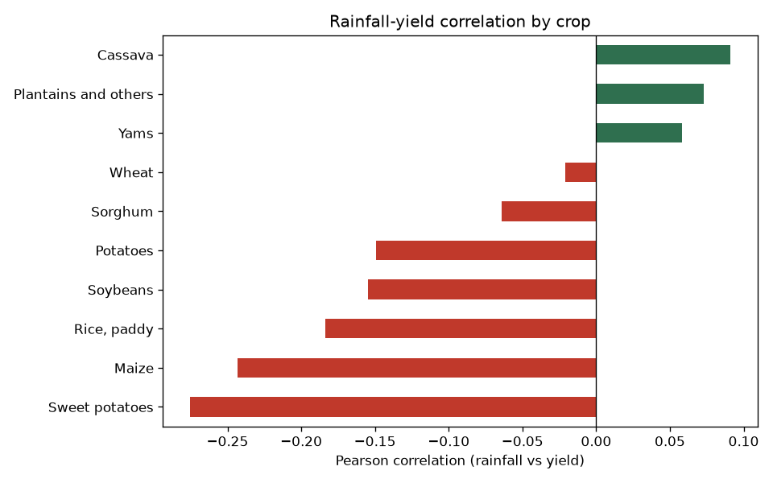
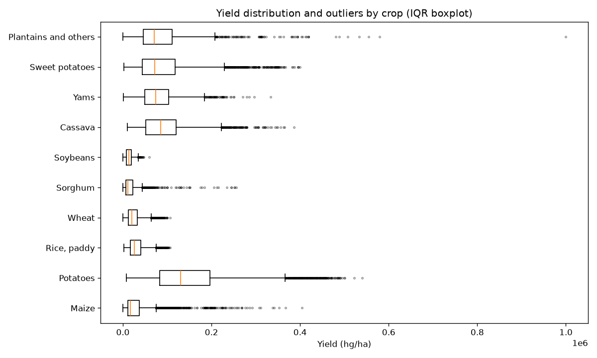
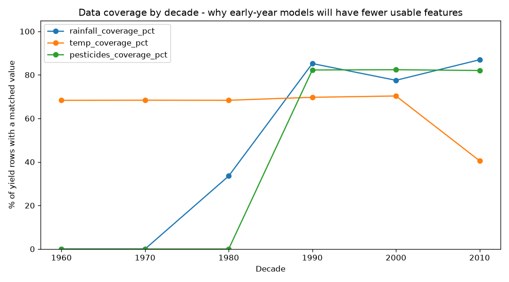

# Phase 7 — Exploratory Data Analysis

Generated by `analytics/eda.py` against `data/processed/curated_dataset.csv` (56,717 rows, 1961–2016, 212 regions, 10 crops). Five business questions, one chart and one answer each.

## Q1. Which crops perform best?

Root/tuber crops (Potatoes 150,083 hg/ha, Cassava 92,769, Sweet potatoes 89,885) far outyield grain crops (Maize 29,360, Wheat 24,607, Soybeans 14,163) in raw hg/ha. This is expected agronomically — tubers are harvested by fresh weight including high water content, while grains are harvested dry — **not evidence that potato farming is more "productive" or profitable than wheat farming**. Any cross-crop yield comparison in later phases must account for this (or stay within-crop, as Phase 6/9 already do).

## Q2. Which regions perform best?

Raw average yield favors whichever region happens to grow the highest-yield crop, so this instead standardizes yield within each crop first (z-score), then averages the z-scores per region — "how far above crop-typical is this region, across every crop it grows." By that fairer measure: **Belgium, Cook Islands, Netherlands, United Kingdom, Denmark** lead (score >1.9). These are small, capital-intensive, temperate-climate agricultural systems — consistent with heavy mechanization/fertilizer input rather than favorable growing conditions alone. The bottom of the list (South Sudan, Equatorial Guinea, Cayman Islands, Eritrea, Central African Republic) skews toward states with limited agricultural infrastructure or very few cultivated crop-years in the data — a sample-size caveat, not just a performance one.

## Q3. How does rainfall relate to yield?

Counterintuitively, rainfall correlates **negatively** with yield for 7 of 10 crops (most strongly for Sweet potatoes -0.28, Maize -0.24, Rice -0.18), and only weakly positively for Cassava/Plantains/Yams. The scatter plot makes the likely explanation visible: the highest-yield region-years cluster at **low** rainfall (<200mm/year) — these are the same hot, arid, high-input regions from Q2 (UAE, Israel, Kuwait — see Phase 6's regional z-scores), which almost certainly rely on irrigation rather than rainfall. **This is a confound, not a causal effect of rain suppressing yield** — correlation measures association only (spec rule, section 6). A within-region-over-time analysis (does a rainier year help the same region's yield?) would be needed to separate "dry regions happen to be intensive" from "rain itself hurts yield," and is flagged as a follow-up for Phase 12 feature engineering / Phase 13 explainability once a model exists to interrogate.

## Q4. Where are the outliers?

IQR-method outlier rates range from 1.1% (Soybeans) to 7.65% (Maize) of that crop's records. Maize and Sorghum (5.26%) have the widest spread relative to their typical value — both are grown across an unusually broad range of farming intensities worldwide (from subsistence to fully industrialized), which mechanically produces more IQR outliers than a crop grown in a narrower range of systems. These are **not** all data errors — Phase 5's Data Quality Engine already caught and quarantined the two genuinely implausible yield records (D5.3); the outliers visible here are almost all legitimate high-performing (or low-performing) region-years, exactly the kind of variation a yield model needs to learn from, not remove.

## Q5. What data problems exist?

The three joined weather/practice columns have **decade-dependent coverage**, directly reflecting each source's year range (documented in `docs/data_dictionary.md`):

| Decade | Rainfall coverage | Temp coverage | Pesticide coverage |
|---|---|---|---|
| 1960s | 0% | 68.3% | 0% |
| 1970s | 0% | 68.4% | 0% |
| 1980s | 33.5% | 68.3% | 0% |
| 1990s | 85.2% | 69.7% | 82.3% |
| 2000s | 77.5% | 70.3% | 82.4% |
| 2010s | 87.0% | 40.5% | 82.0% |

**Implication for later phases**: any model using rainfall or pesticide use as a feature effectively cannot be trained on pre-1990 data (near-zero coverage) — Phase 9's yield model will need to either restrict its training window to 1990+ or treat missingness itself as an informative feature rather than dropping rows. The 2010s temperature drop (70.3% → 40.5%) isn't a new problem — `temp.csv`'s underlying source ends in 2013 (see data dictionary), so 2014–2016 rows structurally cannot match.

## Summary

All five questions are answered with a specific, falsifiable claim backed by a number and a chart — not just "here are some plots." Two follow-ups are explicitly carried forward rather than resolved here: the rainfall-yield confound (Q3) and the pre-1990 feature-coverage gap (Q5), both flagged for the phases that can actually act on them (modeling and feature engineering).
